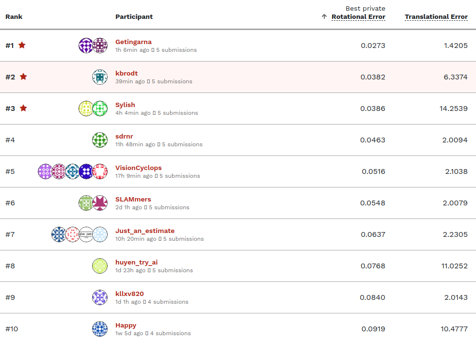

# AISG–SLA Visual Localisation Challenge

[AISG–SLA Visual Localisation Challenge](https://prizechallenge.aisingapore.org/competitions/1/visual-localisation/page/1/)
Develop AI models to accurately extract camera pose data from 2D monocular
images.

[2nd
place](https://prizechallenge.aisingapore.org/competitions/1/visual-localisation/leaderboard/)
out of 335 participants with 0.0382 Rotational Error (top1 0.0273, top3
0.0386).



## Approach

We observe that classical approaches based on ORB (or others) detectors and
FLANN (or others) matchers fail on this task. So, we focus our analisys on
feature detection and feature matching steps. We replace feature detection and
matching models with state-of-the-art dense feature matching deep neural
network model RoMa. We further refine these matching with another deep neural
network model DeDoDe descriptor. We use publicity available pretrained weights
for deep neural network models. Our method doesn't require any retraining and
has good generalization on new tasks. Though one may improve the performance by
finetunning the models to the specific task.

## Highlights

- Traditional indirect method for monocular visual odometry with deep neural
  networks models
- [RoMa](https://github.com/Parskatt/RoMa) regression matcher
- [DeDoDe](https://github.com/Parskatt/DeDoDe) descriptor
- 2D-to-2D for modeling the motion between two frames
- [Bundle adjustment](https://github.com/Parskatt/micro-bundle-adjustment) solver

## Prerequisites & Hardware

- Ubuntu 20.04.6 LTS (GNU/Linux 5.4.0-125-generic x86_64)
- [Python 3.8.10](https://www.python.org/) (GCC 9.4.0)
- Nvidia driver version: 515.65.01
- CUDA version: 11.8
- NVIDIA Tesla V100-SXM2 32GB (usage 16GB)
- [PyTorch 2.0.1](https://pytorch.org/)
- Intel(R) Xeon(R) Gold 6148 CPU @ 2.40GHz
- 755 GB RAM (usage 4 GB RAM)

## Setup & Inference

Download the data from the competition page and unzip into `data` folder. Then
download pretrained models

```bash
sh ./models/download_models.sh
```

Finally, run the script to produce the submission

```bash
sh ./run.sh
```

The script will create virtual environment, install all necessary python
packages and perform inference on test dataset. If script fails try run the
commands line by line. If installation of RoMa, DeDoDe or
micro-bundle-adjustment fail install them in [`libs`](./libs) directory.

The inference takes ~1 hour on 1 GPU V100 32GB.

## Docker

To build docker from [Dockerfile](./docker/Dockerfile):

```bash
sh ./docker/build.sh
```

To run the docker:

```bash
sh ./docker/run.sh
```

Note: paths and some parameters should be replaced.
